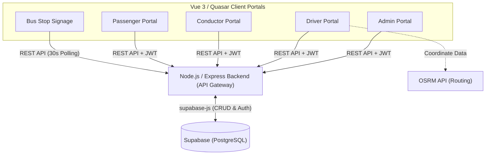

# 🚍 NavSmart: Smart Public Transit Ecosystem

NavSmart is a comprehensive, multi-portal smart public transit management system. It coordinates real-time bus tracking, automated scheduling, mobile ticketing, and driver/conductor operations into a single unified platform.

The entire system is powered by a centralized Node.js/Express backend that acts as an API gateway over a Supabase PostgreSQL database, with distinct Vue 3/Quasar frontends tailored for different user roles (admins, drivers, conductors, and passengers).

## 🏗️ System Architecture

## 📦 The Micro-Repositories

This ecosystem is divided into specialized repositories based on user roles and hardware requirements.

| Portal / Service | Primary Role | Core Tech Stack |
| --- | --- | --- |
| **Admin Portal** | The centralized command center for transit administrators to manage vehicles, staff, routes, schedules, and monitor active trips on a live map. | Vue 3, Quasar, Leaflet, Chart.js |
| **Backend API** | The core API server (Express.js) that enforces business logic, handles custom JWT authentication, and acts as the secure intermediary between the client portals and the Supabase database. | Node.js, Express, bcryptjs, jwt |
| **Driver Portal** | A mobile-first app for drivers to view assigned upcoming laps, start/end active trips, and see the exact route polyline drawn on a map using Open Source Routing Machine (OSRM). | Vue 3, Quasar, vue-leaflet, OSRM |
| **Conductor Portal** | A mobile-first app for bus conductors to issue manual tickets dynamically, track trip occupancy, and scan/validate passenger QR code tickets via device cameras. | Vue 3, Quasar, vue3-qrcode-reader |
| **Passenger Portal** | The consumer-facing web application where passengers can search for routes, book tickets, process simulated payments, and generate digital QR tickets. | Vue 3, Quasar, vue3-qrcode-reader |
| **Bus Stop Signage** | A digital signage application designed for public bus stops, continuously polling the backend to display arriving buses and live trip statuses to waiting passengers. | Vue 3, Quasar, Pinia |

## 🚀 Core Data Flow Example (Starting a Trip)

1. **Definition:** An admin creates a recurring schedule in the `admin-portal`. This fires an Axios POST to `/api/schedules` on the backend, writing to Supabase.
2. **Expansion:** The driver opens the `driver-portal`. The frontend fetches the schedules, and a local Javascript algorithm expands that single schedule into multiple "virtual slots" (laps) based on interval timings.
3. **Execution:** The driver clicks "Start Trip" on Lap 1. The `driver-portal` sends a POST to `/api/trips` with the `in_progress` status, creating an active trip row in Supabase.
4. **Broadcast:**
* The `bus-stop-portal`, which auto-polls `/api/trips` every 30 seconds, detects the new `in_progress` trip and instantly displays the bus as arriving on the public screen.
* The `conductor-portal` fetches `/api/trips`, identifies the `in_progress` trip assigned to their `conductor_id`, and automatically unlocks the QR scanning and manual ticketing UI for that specific route.
