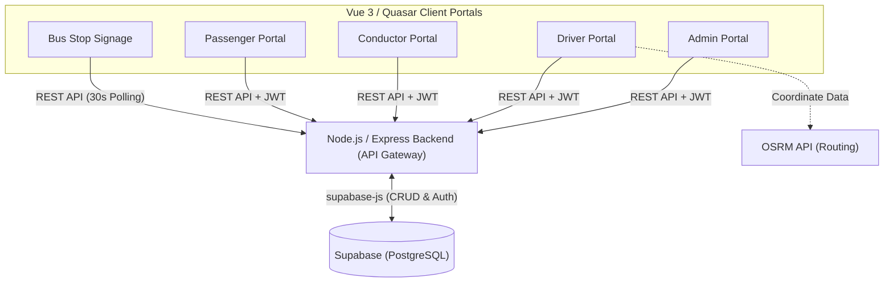

# NavSmart: Automated Transit & Route Management Ecosystem

NavSmart is an enterprise-grade Automated Bus Scheduling and Route Management System. It was originally developed as a **Finalist solution for the Smart India Hackathon (SIH)**, specifically targeting the Delhi Transport Corporation's (DTC) operational bottlenecks.

The system replaces manual, resource-intensive logistics with a highly automated micro-frontend architecture. It specializes in two core transit problems:
1. **Algorithmic Duty Scheduling:** Managing both *Linked* (fixed crew/bus) and *Unlinked* (dynamic handovers/rest periods) crew schedules.
2. **GIS Route Management:** Utilizing real-world map data to map existing networks, draw new routes, and highlight geographical overlaps to reduce congestion.

Powered by a centralized Node.js/Express API gateway and a Supabase PostgreSQL database, the ecosystem serves distinct Vue 3/Quasar frontends tailored for admins, drivers, conductors, and passengers.
## System Architecture

## The Micro-Repositories

This ecosystem is divided into specialized client applications. You can test the live deployments below.

| Portal | Primary Role | Live Link |
| :--- | :--- | :--- |
| **Admin Portal** | Command center for transit administrators to manage data and monitor live maps. | [navsmart-admin-portal.vercel.app](https://navsmart-admin-portal.vercel.app/) |
| **Customer Portal** | Passenger web app for journey planning and QR ticket generation. | [navsmart-everything-portal.vercel.app](https://navsmart-everything-portal.vercel.app/#/) |
| **Driver Portal** | App for drivers to start trips and view exact route polylines. | [navsmart-driver-portal.vercel.app](https://navsmart-driver-portal.vercel.app/) |
| **Conductor Portal** | App for conductors to issue tickets and scan passenger QR codes. | [navsmart-conductor-portal.vercel.app](https://navsmart-conductor-portal.vercel.app/) |
| **Bus Stop Signage** | Digital signage that auto-polls the API to display real-time ETA to passengers. | [navsmart-bus-stop-portal.vercel.app](https://navsmart-bus-stop-portal.vercel.app/) |
| **Backend API** | Secure Node.js middleware enforcing business logic and custom JWT authentication. | *Internal API Service (Render)* |

## Core Data Flow Example (Starting a Trip)

1. **Definition:** An admin creates a recurring schedule in the `admin-portal`. This fires an Axios POST to `/api/schedules` on the backend, writing to Supabase.
2. **Expansion:** The driver opens the `driver-portal`. The frontend fetches the schedules, and a local Javascript algorithm expands that single schedule into multiple "virtual slots" (laps) based on interval timings.
3. **Execution:** The driver clicks "Start Trip" on Lap 1. The `driver-portal` sends a POST to `/api/trips` with the `in_progress` status, creating an active trip row in Supabase.
4. **Broadcast:**
* The `bus-stop-portal`, which auto-polls `/api/trips` every 30 seconds, detects the new `in_progress` trip and instantly displays the bus as arriving on the public screen.
* The `conductor-portal` fetches `/api/trips`, identifies the `in_progress` trip assigned to their `conductor_id`, and automatically unlocks the QR scanning and manual ticketing UI for that specific route.
